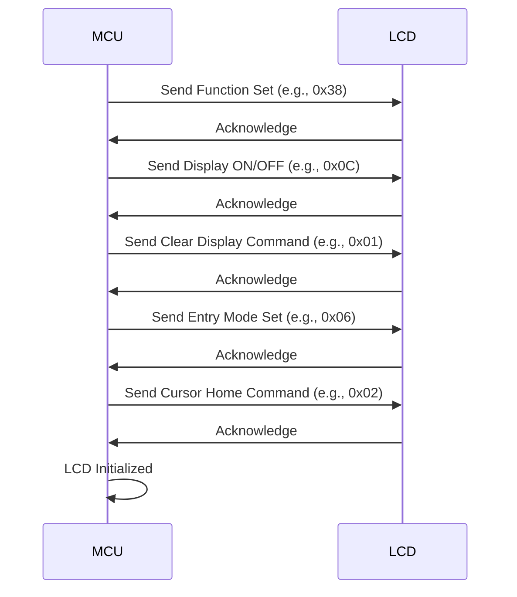
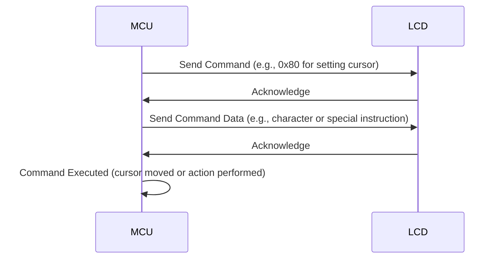
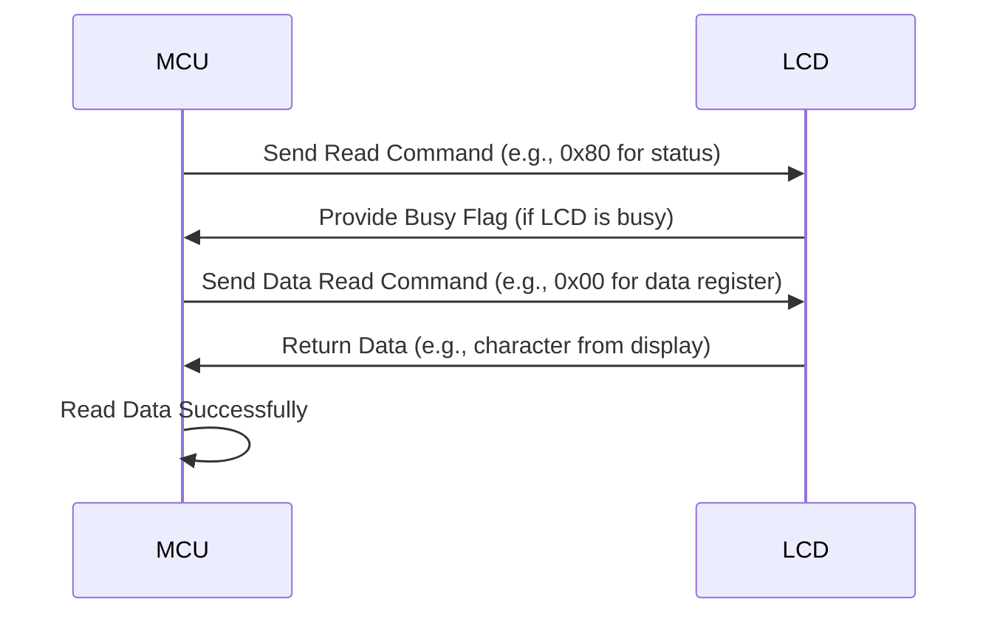
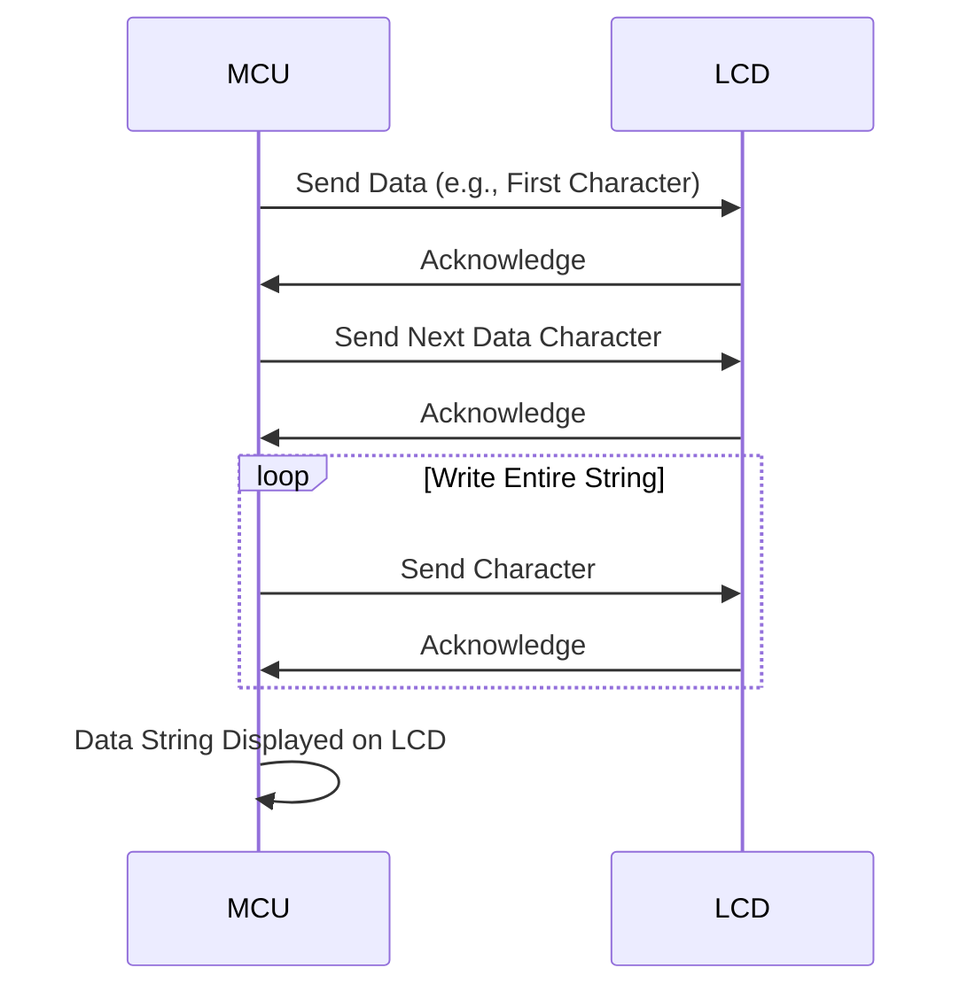

# Master Embedded Systems: Projects with Atmega328, Arduino, and Eagle-PCB

Welcome to the **Embedded Systems Projects** repository! This repository contains a collection of projects using the **Atmega328** microcontroller, **Arduino**, and **Eagle PCB design**. These projects are designed for beginners who want to learn embedded systems concepts, build real-world applications, and fabricate their own PCBs.

## Table of Contents

- [Overview](#overview)
- [Understanding Microcontrollers: Atmega328 Basics](#understanding-microcontrollers-atmega8-basics)
- [Compile a C file using WinAVR](#compile-a-c-file-using-winavr)
- [Programming with Arduino IDE](#programming-with-arduino-ide)
- [Installing Arduino IDE and Setting Up ATmega328/UNO Board](#installing-arduino-ide-and-setting-up-atmega328uno-board)
- [Setting Up USBASP Programmer and USB-to-Serial Converter](#setting-up-usbasp-programmer-and-usb-to-serial-converter)
- [Eagle PCB Design: From Schematic to Fabrication](#eagle-pcb-design-from-schematic-to-fabrication)
- [DIY PCB Fabrication Process](#diy-pcb-fabrication-process)
- [HD44780 LCD Communication Protocol](#hd44780-lcd-communication-protocol)

## Overview

This repository provides practical examples of embedded systems projects using the **Atmega328** microcontroller and **Arduino** platform. You will also explore **Eagle PCB design** for creating custom PCBs. The goal is to build a solid foundation for working with embedded systems and PCB fabrication.

## Understanding Microcontrollers: Atmega8 Basics

A **microcontroller** is a compact integrated circuit that acts as the brain of an embedded system. It combines a processor (for executing instructions), memory (for storing programs and temporary data), and input/output pins (for connecting to external devices) all in one chip. Unlike general-purpose computers, microcontrollers are designed to perform specific tasks, such as controlling an appliance, blinking an LED, or reading data from a sensor. Their versatility and low cost make them a cornerstone of modern electronics, found in everything from toys to industrial machinery.

The **Atmega328**, part of the AVR family, is a popular 8-bit microcontroller for beginners. Built on the efficient AVR architecture, it uses a Reduced Instruction Set Computer (RISC) design for faster performance. It features 32 KB of Flash memory for program storage, 1 KB of SRAM for temporary data, and 512 bytes of EEPROM for saving data even when power is off. With 23 input/output pins, built-in timers, a 10-bit Analog-to-Digital Converter (ADC), and communication protocols like UART, SPI, and I2C, the Atmega328 is ideal for learning how microcontrollers work. Its simplicity, combined with powerful features, makes it a go-to choice for building practical projects like motor control, sensor interfacing, and custom PCB designs.

## Compile a C file using WinAVR

To compile a C file using **WinAVR**, follow these steps:

### Step 1: Install WinAVR

Download and install **WinAVR** from its [official site](http://winavr.sourceforge.net/) or a trusted source.  
This package includes:
- **avr-gcc compiler**
- **avrdude**
- Supporting tools

### Step 2: Write the C Program

Create your C program and save it with a `.c` extension. For example, `main.c`.

### Step 3: Create a Makefile

Create a file named `Makefile` in the same directory as your C program.

Here is a simple example of a Makefile:

```makefile
MCU = atmega8       # Target microcontroller (change as needed)
F_CPU = 16000000UL  # Clock frequency
CC = avr-gcc
CFLAGS = -mmcu=$(MCU) -DF_CPU=$(F_CPU) -Wall -Os
TARGET = main

all: $(TARGET).hex

$(TARGET).hex: $(TARGET).elf
	avr-objcopy -O ihex -R .eeprom $(TARGET).elf $(TARGET).hex

$(TARGET).elf: $(TARGET).c
	$(CC) $(CFLAGS) -o $(TARGET).elf $(TARGET).c

clean:
	rm -f *.elf *.hex
```
### Makefile Explanation:

- `MCU`: Specify your microcontroller model (e.g., atmega8, atmega328p).
- `F_CPU`: Specify the frequency of your microcontroller in Hz.
- Replace `main.c` with the name of your C file if different.

### Step 4: Compile the Program

1. Open a command prompt.
2. Navigate to the folder containing your `main.c` and `Makefile`.
3. Run the `make` command:

```bash
make
```
This will compile your code and generate a .hex file ready for uploading to the microcontroller.

### Step 5: Upload to the Microcontroller

Use avrdude to upload the .hex file to your microcontroller. For example:

```bash
avrdude -c usbasp -p atmega8 -U flash:w:main.hex
```
Replace usbasp with your programmer.
Replace atmega8 with your microcontroller model.

### Step 6: Verify the Program

Ensure your microcontroller runs the compiled program as expected.

### Troubleshooting

If you encounter issues:

    Verify the MCU and F_CPU values match your microcontroller.
    Ensure all paths are set correctly in the environment variables if make or avr-gcc is not recognized.

## Programming with Arduino IDE

Arduino provides several built-in functions to interact with hardware components like LEDs, sensors, and motors. Here’s an overview of the most commonly used functions, explained in a simple way.

### `pinMode()`
Configures a GPIO pin as an **input** or **output**.  
- **pin**: The pin number you want to set (e.g., 2, 13).  
- **mode**: Use `INPUT`, `OUTPUT`, or `INPUT_PULLUP`.  

**Example**:  
```cpp
pinMode(13, OUTPUT); // Set pin 13 as output
pinMode(2, INPUT);   // Set pin 2 as input
```
### `digitalWrite()`
Sets a pin to either HIGH (on) or LOW (off).

**Example**:  
```cpp
digitalWrite(13, HIGH); // Turn on LED connected to pin 13
digitalWrite(13, LOW);  // Turn it off
```
### `digitalRead()`
Reads the state of a digital input pin (HIGH or LOW).

**Example**:  
```cpp
int buttonState = digitalRead(2); // Read the state of the button on pin 2
```
### `analogWrite()`
Generates a PWM signal to control the brightness of LEDs or the speed of motors.

value: Ranges from 0 (off) to 255 (full brightness or speed).

**Syntax**:
```cpp
analogWrite(pin, value);
```

**Example**:
```cpp
analogWrite(9, 128); // Set 50% brightness on pin 9
```
### `delay()`
Pauses the program for a specified time in milliseconds.

**Syntax**:
```cpp
delay(milliseconds);
```

**Example**:
```cpp
delay(1000); // Wait for 1 second
```
### `Serial.begin`()
Initializes communication between the Arduino and a computer. The baud rate determines the speed of communication (e.g., 9600 bits per second).

**Syntax**:
```cpp
Serial.begin(baudRate);
```

**Example**:
```cpp
Serial.begin(9600); // Start communication at 9600 bps
```
### `Serial.print() and Serial.println()`
Send data or messages to the computer via the Serial Monitor.
Serial.print(): Prints data on the same line.
Serial.println(): Prints data and moves to the next line.

**Example**:
```cpp
Serial.print("Temperature: ");
Serial.println(25);
```
### `Serial.read()`
Reads incoming data from the serial buffer (one byte at a time).

**Syntax**:
```cpp
char data = Serial.read();
```
**Example**:
```cpp
if (Serial.available() > 0) {
    char receivedData = Serial.read(); // Read the first available byte
}
```

## Installing Arduino IDE and Setting Up ATmega328/UNO Board

This guide provides a brief explanation on how to install the Arduino IDE and set up the **ATmega328** or **Arduino Uno** board.

### 1. Install the Arduino IDE

#### a. Download and Install
1. Visit the official [Arduino website](https://www.arduino.cc/en/software).
2. Download the appropriate version for your operating system (Windows, macOS, Linux).
3. Follow the installation instructions:
   - For Windows: Run the installer `.exe` file and follow the prompts.
   - For macOS: Open the `.dmg` file and drag the Arduino IDE to the Applications folder.
   - For Linux: Use the package manager or install from the tarball.

#### b. Launch the IDE
After installation, launch the **Arduino IDE**. You should see the Arduino IDE window ready for use.

### 2. Set Up the ATmega328/UNO Board in Arduino IDE

#### a. Open the Arduino IDE
1. Open the **Arduino IDE** after installation.

#### b. Select the Board (ATmega328/UNO)
1. Go to **Tools** → **Board** → **Arduino Uno** (which uses the ATmega328P microcontroller).
2. Select **Arduino Uno** from the list of available boards.

#### c. Select the Port
1. Connect your **Arduino Uno** to your computer using a USB cable.
2. Go to **Tools** → **Port** and select the correct port where your Arduino Uno is connected. On Windows, this is usually something like `COM3` or `COM4`. On macOS/Linux, it will show up as `/dev/cu.usbmodemXXXX`.

### 3. Install the ATmega328 Drivers (if needed)

If your Arduino Uno is not recognized or you're using a clone board, you may need to install drivers.

- **For Windows**: The drivers are automatically installed when you install the Arduino IDE. However, for clone boards, you may need to manually install the **CH340/CH341** driver from the manufacturer's website.
- **For macOS/Linux**: These platforms usually don’t require additional drivers. If needed, you can find open-source drivers or use tools like **brew** on macOS.

### 4. Test the Setup

To confirm everything is set up correctly:

1. Open the **Arduino IDE**.
2. Go to **File** → **Examples** → **01.Basics** → **Blink**.
3. Click the **Upload** button (right arrow icon).
4. The LED on pin 13 of the Arduino Uno should start blinking if everything is configured properly.

You have now successfully set up the Arduino IDE for programming the **ATmega328/Uno** board.

## Setting Up USBASP Programmer and USB-to-Serial Converter

This guide explains how to set up the **USBASP programmer** for programming an ATmega328 on a custom PCB and the **USB-to-serial converter** to read data from the board using the **Arduino IDE**.

### 1. Setting Up USBASP Programmer

#### a. Connect the USBASP Programmer to the ATmega328
1. **USBASP Pin Connections**:
   - **MISO** (Master In Slave Out) → **MISO** pin of ATmega328
   - **MOSI** (Master Out Slave In) → **MOSI** pin of ATmega328
   - **SCK** (Serial Clock) → **SCK** pin of ATmega328
   - **RESET** → **RESET** pin of ATmega328
   - **VCC** → **VCC** pin of ATmega328 (5V)
   - **GND** → **GND** pin of ATmega328

2. Ensure that the **USBASP** programmer is securely connected to the **ISP header** (In-System Programming) of your custom PCB.

#### b. Install USBASP Drivers
If your computer does not automatically recognize the **USBASP programmer**, you may need to install drivers:

- **For Windows**: Download and install the **USBASP drivers** from [fischl.de](http://www.fischl.de/usbasp/).
- **For macOS/Linux**: These platforms typically don't require drivers. If needed, you can install **libusb** or use open-source drivers.

#### c. Select USBASP Programmer in Arduino IDE
1. Open **Arduino IDE**.
2. Go to **Tools** → **Programmer** → Select **USBasp**.

### 2. Setting Up USB-to-Serial Converter

#### a. Connect the USB-to-Serial Converter to the ATmega328
To read data from the ATmega328 on your custom PCB, you can use a **USB-to-Serial converter** (e.g., FTDI or CP2102). Here’s how to connect the pins:

1. **USB-to-Serial Pin Connections**:
   - **TX (Transmit)** → **RX** pin of ATmega328
   - **RX (Receive)** → **TX** pin of ATmega328
   - **VCC** → **VCC** pin of ATmega328 (5V)
   - **GND** → **GND** pin of ATmega328
   
2. Make sure the **USB-to-Serial converter** is connected to your PC via USB, and the other side is connected to the ATmega328.

#### b. Select the Serial Port in Arduino IDE
1. Go to **Tools** → **Port** and select the correct COM port for your USB-to-Serial device.
   - On Windows, this could be something like `COM3` or `COM4`.
   - On macOS/Linux, it will be `/dev/cu.usbserial-xxxx`.

#### c. Upload Code and Read Data via Serial Monitor
1. Write your program in **Arduino IDE** and upload it to the ATmega328.
2. Open **Tools** → **Serial Monitor** in Arduino IDE to view data transmitted via **Serial Communication**.
3. Use `Serial.print()` or `Serial.println()` in your program to send data to the **Serial Monitor**.

### 3. Uploading the Program to the ATmega328

### a. Using USBASP Programmer
1. Connect the **USBASP** programmer to your custom PCB.
2. Select **Tools** → **Board** → **Arduino Uno** (for ATmega328).
3. Select **Tools** → **Programmer** → **USBasp**.
4. Click the **Upload Using Programmer** button (Shift + Upload button) to upload the code to the ATmega328.

#### b. Reading Data via Serial Monitor
1. Once the code is uploaded, you can monitor the output of your ATmega328 using **Serial Monitor** (set baud rate as per your code, e.g., 9600).
2. Use `Serial.print()` in your program to send real-time data to the Serial Monitor for debugging or display purposes.

### 4. Troubleshooting

- **USBASP Not Recognized**: If your **USBASP** is not recognized, ensure the drivers are properly installed. On Windows, check for any driver conflicts in the **Device Manager**.
- **No Output on Serial Monitor**: If you're not seeing data in the **Serial Monitor**, check the **TX/RX** connections between the **USB-to-Serial converter** and the **ATmega328**. Also, ensure the baud rate in the `Serial.begin()` matches the baud rate set in the **Serial Monitor**.

## Eagle PCB Design: From Schematic to Fabrication

This guide explains how to use **Eagle PCB Design Software** to create a schematic, design a PCB, and prepare it for fabrication.

### 1. Creating the Schematic in Eagle

1. **Open Eagle Software** and create a new project.
2. In the **Control Panel**, right-click on the project folder and select **New** → **Schematic**.
3. Add components by clicking on the **Add Part** tool, search for components (e.g., resistors, capacitors, ICs) from the libraries.
4. Use the **Wire** tool to connect the components as per your circuit design.
5. Label your nets using the **Label** tool to make the connections clear.
6. Once the schematic is complete, run the **ERC (Electrical Rule Check)** to ensure there are no errors in the design.

### 2. Designing the PCB Layout

1. After completing the schematic, switch to the **PCB Layout** by clicking on the **Switch to Board** button.
2. Eagle will automatically create a board outline, but you can customize it according to your needs.
3. Arrange the components on the board, making sure to keep routing clean and components placed logically.
4. Use the **Route** tool to draw the PCB traces, connecting the components' pins.
5. Add a **Ground Plane** using the **Polygon** tool to reduce noise and improve stability.

### 3. Checking and Finalizing the Design

1. Run the **DRC (Design Rule Check)** to verify that the traces and components meet the fabrication requirements (e.g., trace width, spacing).
2. Use the **Electrical Rule Check (ERC)** to ensure there are no electrical issues.
3. Once everything looks good, generate the **Gerber Files** required for PCB fabrication.

### 4. Fabricating the PCB

1. Export the Gerber files by going to **File** → **CAM Processor**, then selecting the required file outputs (e.g., **Top Layer**, **Bottom Layer**, **Solder Mask**, **Drill Files**).
2. Send the Gerber files to a PCB fabrication service. There are several online services available for custom PCB manufacturing.
3. After the PCB is fabricated, you can solder the components and test the board for functionality.

## DIY PCB Fabrication Process

This guide will walk you through the steps for fabricating a **Printed Circuit Board (PCB)** at home using a **laser printer**, **iron box (clothes iron)**, **ferric chloride (etchant)**, and manual drilling for holes.

### Materials Needed:
- **Laser Printer** (for printing your PCB design)
- **Parchment Paper** (or glossy photo paper)
- **Iron Box** (for transferring toner to the PCB)
- **Ferric Chloride Solution** (for etching the PCB)
- **Copper-Clad PCB Board** (for the base material)
- **Fine Sandpaper** (to clean the PCB)
- **Drill** (for manually drilling holes)
- **Acetone** (for cleaning the PCB)
- **Masking Tape** (optional, to hold the paper in place)

### Step 1: Design the PCB

1. **Create the PCB Design**: Use PCB design software like **Eagle**, **KiCad**, or **EasyEDA** to design your circuit schematic and PCB layout.
2. **Export the Design**: Once your design is ready, export it as a **mirror image** (in Gerber or PDF format) to ensure proper alignment during the transfer.

### Step 2: Print the PCB Design

1. **Print the Design**: Print your mirrored PCB design onto **glossy photo paper** or **parchment paper** using a **laser printer**. Inkjet printers won't work for this method because toner is required to transfer to the PCB.
2. **Print at High Quality**: Ensure you select the highest print quality and set the paper to **no scaling** to preserve the exact size of your design.

### Step 3: Prepare the Copper-Clad PCB

1. **Clean the PCB**: Use **fine sandpaper** to gently sand the surface of the **copper-clad PCB**. This helps the toner adhere better.
2. **Clean the Board**: After sanding, clean the board with **acetone** or rubbing alcohol to remove any grease, dust, or debris.

### Step 4: Transfer the Toner

1. **Position the Printed Design**: Place the printed design (toner side down) onto the copper surface of the PCB. Ensure it aligns correctly.
2. **Secure the Paper**: Use **masking tape** to hold the paper in place if necessary.
3. **Iron the Paper onto the PCB**:
   - Preheat the **iron box** to a medium-high heat setting (no steam).
   - Press the iron firmly onto the paper for about **3-5 minutes**, ensuring that the heat is evenly distributed over the entire design.
   - Apply even pressure and make small circular movements to ensure good contact.
4. **Check the Transfer**: After a few minutes, peel off the paper. The toner should have transferred to the PCB, leaving the copper areas exposed for etching.

### Step 5: Etch the PCB

1. **Prepare Ferric Chloride Solution**: Mix **ferric chloride** with water (usually 1 part ferric chloride to 3 parts water). You can use a plastic or glass container to hold the solution.
2. **Submerge the PCB**: Place the PCB in the **ferric chloride solution**. Gently agitate the container to help the etching process.
3. **Wait for the Etching Process**: The ferric chloride will dissolve the exposed copper, leaving the toner-protected copper traces intact. This usually takes about **30 minutes to 1 hour**.
4. **Check Progress**: Periodically check the progress. Once all the exposed copper is etched away and only the toner traces remain, remove the PCB from the solution.

### Step 6: Clean and Finalize the PCB

1. **Remove the Toner**: After etching, the PCB will be covered in toner. Use **acetone** to remove the toner and reveal the copper traces.
2. **Drill Holes**: For components that require through-hole connections, carefully drill the holes using a small **drill bit**. You can use a handheld drill or a Dremel tool.
   - Make sure to use the correct bit size for the components' lead diameter.
   - Keep the PCB steady and drill at a slow speed to avoid damaging the traces.

### Step 7: Inspect the PCB

1. **Inspect for Errors**: Carefully inspect the PCB for any missed connections, broken traces, or incomplete etching. You can fix minor issues with **conductive ink** or **wire bridges**.
2. **Test the PCB**: Before soldering components, it's a good idea to test the board with a multimeter to ensure the traces and connections are correct.

### Conclusion

Congratulations! You've just fabricated your own **PCB** at home. Now, you can proceed with **soldering the components** onto the PCB, and your custom circuit is ready to be used. While this process can take some time, it's a great and cost-effective way to create your own PCBs without needing a professional service.

## HD44780 LCD Communication Protocol


### Initialization Sequence (Setting up the LCD)


### Write Command Sequence (Sending Command to LCD)



### Read Command Sequence (Reading Status or Data from LCD)



### Write Data String Sequence (Sending a Data String to LCD for Display)




