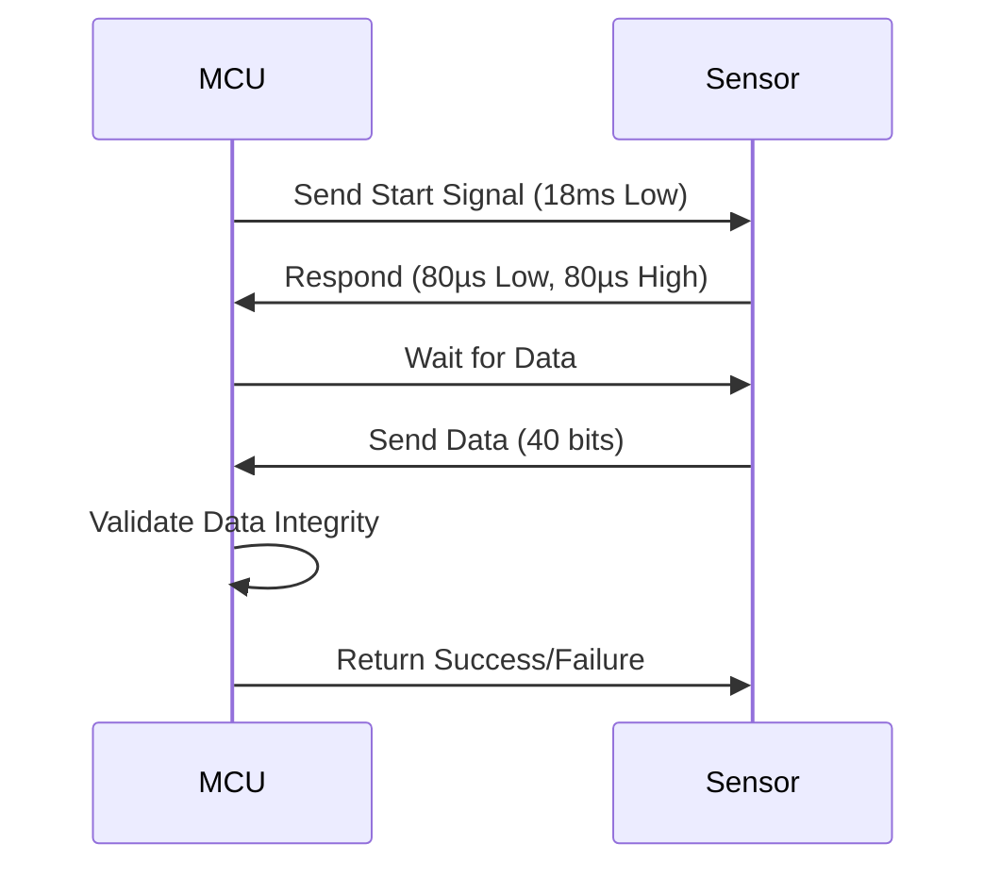

# Smart Fan Speed Control Using DHT11 and AVR Microcontroller

This project demonstrates how to control the speed of a fan based on room temperature readings from a **DHT11 sensor**. The speed of the fan is controlled using **Pulse Width Modulation (PWM)** through an **AVR microcontroller**. This guide explains how to set up the hardware and software for this project, along with the necessary flashing and PCB creation steps.

## Components Used
- **AVR Microcontroller** (e.g., ATmega328P)
- **DHT11 Temperature and Humidity Sensor**
- **PWM-Controlled Fan**
- **NPN Transistor (e.g., 2N2222) or MOSFET** (for controlling the fan)
- **Resistors, Capacitors, and other Passive Components**

## DHT11 Sensor Details

The **DHT11** sensor is a basic, low-cost digital sensor used for measuring temperature and humidity. It communicates with a microcontroller using a **single-wire digital interface**, sending data as a **serial stream** of 40 bits.

### Key Features of DHT11:
- **Temperature Range**: 0°C to 50°C (accuracy: ±2°C)
- **Humidity Range**: 20% to 90% RH (accuracy: ±5% RH)
- **Output**: Digital (serial)
- **Operating Voltage**: 3.5V to 5.5V

### DHT11 Communication Protocol
The DHT11 sensor uses a **single-wire communication protocol** to transmit data. The sensor sends data in **40 bits**:
1. **Humidity (16 bits)**: The first 16 bits represent humidity data.
2. **Temperature (16 bits)**: The next 16 bits represent temperature data.
3. **Checksum (8 bits)**: The last 8 bits are a checksum to verify the accuracy of the data.

To communicate with the DHT11 sensor, the microcontroller sends a **start signal** to the sensor, which responds with the requested data.

### DHT11 Communication Sequence Diagram


## Project Overview

This project reads the room temperature from the DHT11 sensor, then adjusts the fan speed accordingly using **PWM**. The fan speed increases with higher temperatures, providing an effective and efficient cooling system. The control is implemented using an **AVR microcontroller** (e.g., ATmega328P) which reads the DHT11 sensor and adjusts the PWM signal for fan control.

## Flashing the Code
To flash the code to your AVR microcontroller, you can follow the instructions below:

Install WinAVR:

WinAVR includes the avr-gcc compiler and other tools required to program your AVR microcontroller. Follow the installation guide in the main repository README.

## Program the Microcontroller:

For Arduino: You can use the Arduino IDE to upload the code to your AVR microcontroller. Select the correct board and port in the Tools menu, then click Upload.

For WinAVR: Open a command prompt and use avr-gcc and avrdude to compile and upload the code. Example:

```bash
avr-gcc -mmcu=atmega328p -o program.elf program.c
avr-objcopy -O ihex program.elf program.hex
avrdude -c usbasp -p m328p -U flash:w:program.hex
```
## Flashing Details and Custom PCB Creation

For detailed flashing instructions, please refer to the main repository README.

## Custom PCB Creation: 

If you wish to create a custom PCB for this project, you can follow the steps provided in the main repository. The PCB design can be created using Eagle PCB as outlined in the repository.

## Troubleshooting
If the fan does not adjust speed:

Verify that the PWM pin is properly connected.
Ensure that the DHT11 sensor is connected correctly to the microcontroller.
Check if the microcontroller is properly powered.
If the DHT11 sensor gives inaccurate readings:

Ensure that the DHT11 sensor is connected properly.
Confirm that the sensor's data line is connected to the correct digital pin.
